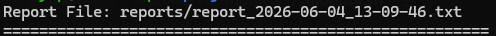
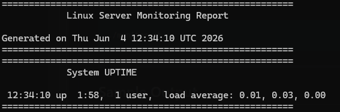
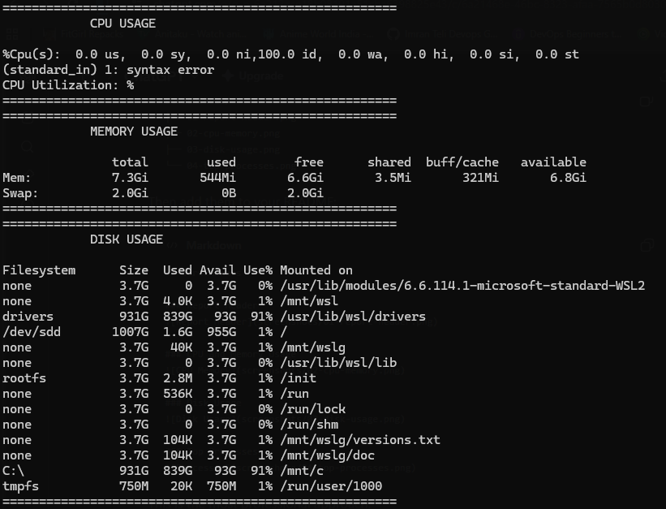
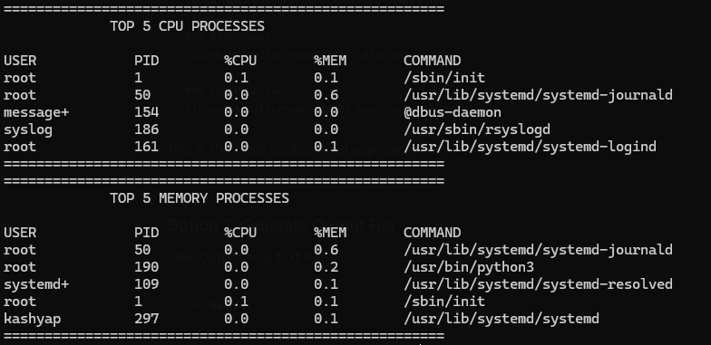

# Linux Server Monitor

A lightweight Linux server monitoring tool built using Bash scripting.

This script provides a quick overview of system health by displaying CPU utilization, memory usage, disk usage, system uptime, and the top resource-consuming processes.

---

## Features

* System Uptime Monitoring
* CPU Utilization Calculation
* Memory Usage Monitoring
* Disk Usage Monitoring
* Top 5 CPU-Consuming Processes
* Top 5 Memory-Consuming Processes
* Clean and formatted terminal output
* Lightweight and dependency-free (except `bc`)
* Automatic Timestamped Report Generation

---

## Technologies Used

* Linux
* Bash Scripting
* AWK
* top
* ps
* free
* df
* bc

---

## Project Structure

```text
linux-server-monitor/
|
├── .gitignore
├── LICENSE
├── README.md
├── monitor.sh
├── reports
│   └── .gitkeep
└── screenshots
    ├── .gitkeep
    ├── CPU-Memory-Disk Usage.png
    ├── System-Report.png
    └── Top-Processors.png
```

---

## Prerequisites

Ensure the following utilities are available on your Linux system:

```bash
bash
top
awk
ps
free
df
bc
```

Install `bc` if it is not already installed.

Ubuntu/Debian:

```bash
sudo apt install bc
```

RHEL/CentOS:

```bash
sudo yum install bc
```

---

## How to Run

Clone the repository:

```bash
git clone <repository-url>
```

Navigate to the project directory:

```bash
cd linux-server-monitor
```

Make the script executable:

```bash
chmod +x monitor.sh
```

Run the script:

```bash
./monitor.sh
```

---

## Sample Output

### Report Generation


### Report Header


### CPU and Memory and Disk Usage


### Top Processes


---

## Learning Objectives

This project demonstrates practical knowledge of:

* Linux System Administration
* Shell Scripting
* Process Monitoring
* Resource Utilization Analysis
* Command-Line Automation
* Text Processing using AWK

---

## Future Enhancements

* Generate timestamped report files
* Export reports to logs
* Colorized terminal output
* CPU, Memory and Disk threshold alerts
* Email notifications
* Cron job automation
* Docker containerization
* Multi-server monitoring

---

## Author

Kashyap Kurani

---

## License

This project is licensed under the MIT License.

