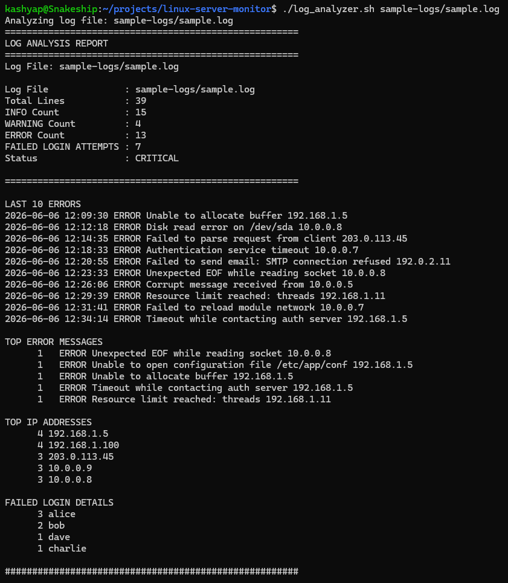

# Linux Monitoring & Log Analysis Toolkit

A Bash-based Linux operations toolkit that provides system monitoring, report generation, and log analysis capabilities.

This project demonstrates practical Linux administration, Bash scripting, monitoring, troubleshooting, and log analytics skills commonly used by DevOps and Cloud Engineers.

---

## Features

### System Monitoring

* System Uptime Monitoring
* CPU Utilization Monitoring
* Memory Usage Monitoring
* Disk Usage Monitoring
* Top 5 CPU-Consuming Processes
* Top 5 Memory-Consuming Processes
* Automatic Timestamped Report Generation

### Log Analysis

* Analyze one or multiple log files
* Count INFO, WARNING, ERROR, and FAILED_LOGIN events
* Display last 10 error messages
* Identify top error patterns
* Detect most frequent IP addresses
* Track failed login attempts by username
* Input validation and error handling

---

## Technologies Used

* Linux
* Bash Scripting
* AWK
* Grep
* Sort
* Uniq
* WC
* Top
* PS
* BC

---

## Project Structure

```text
linux-server-monitor/
│
├── monitor.sh
├── log_analyzer.sh
│
├── reports/
│   └── .gitkeep
│
├── sample-logs/
│   └── sample.log
│
├── screenshots/
│
├── README.md
├── LICENSE
└── .gitignore
```

---

## System Monitoring Usage

Make the script executable:

```bash
chmod +x monitor.sh
```

Run:

```bash
./monitor.sh
```

A timestamped report will automatically be generated:

```text
reports/report_YYYY-MM-DD_HH-MM-SS.txt
```

---

## Log Analyzer Usage

Make the script executable:

```bash
chmod +x log_analyzer.sh
```

Analyze a single log file:

```bash
./log_analyzer.sh sample-logs/sample.log
```

Analyze multiple log files:

```bash
./log_analyzer.sh app.log auth.log nginx.log
```

---

## Sample Output

### Monitoring Report

Displays:

* System uptime
* CPU utilization
* Memory utilization
* Disk utilization
* Top CPU-consuming processes
* Top memory-consuming processes

### Log Analysis Report

Displays:

* Total log entries
* Error, warning and info counts
* Failed login attempts
* Recent errors
* Top error messages
* Top IP addresses

---

## Screenshots

### System Monitoring Report


### CPU, Memory and Disk Usage


### Top Processes


### Report Generation


### Log Analysis Report



---

## Learning Outcomes

This project demonstrates:

* Linux Administration
* Bash Scripting
* Process Monitoring
* Log Analysis
* Linux Troubleshooting
* Text Processing with AWK
* Regular Expressions
* Report Generation
* Shell Script Automation

---

## Future Enhancements

* Health Status Checks
* CPU / Memory / Disk Threshold Alerts
* Email Notifications
* Colorized Output
* Support for Real Linux Authentication Logs
* Scheduled Execution via Cron
* Docker Containerization

---

## Author

Kashyap Kurani

## License

Licensed under the MIT License.
